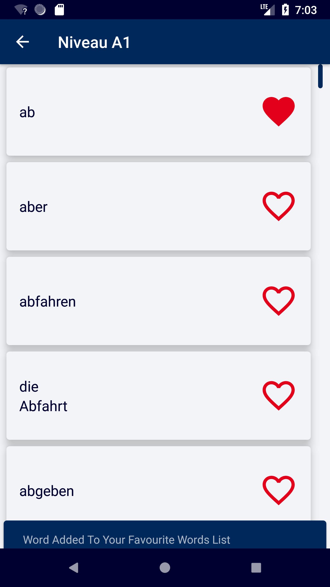
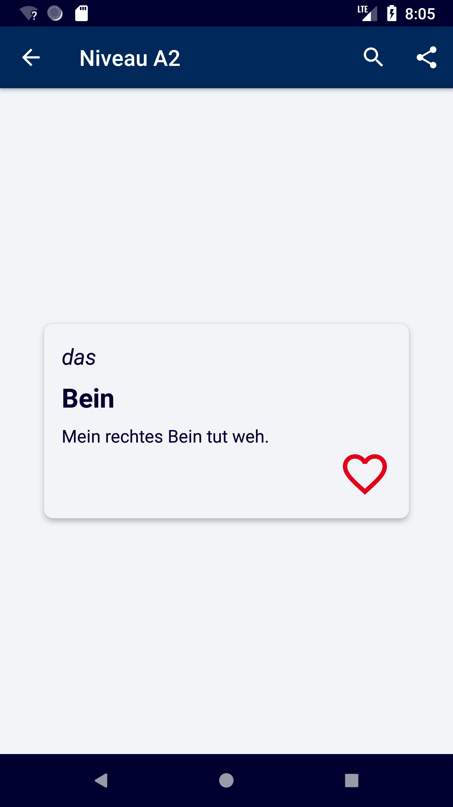
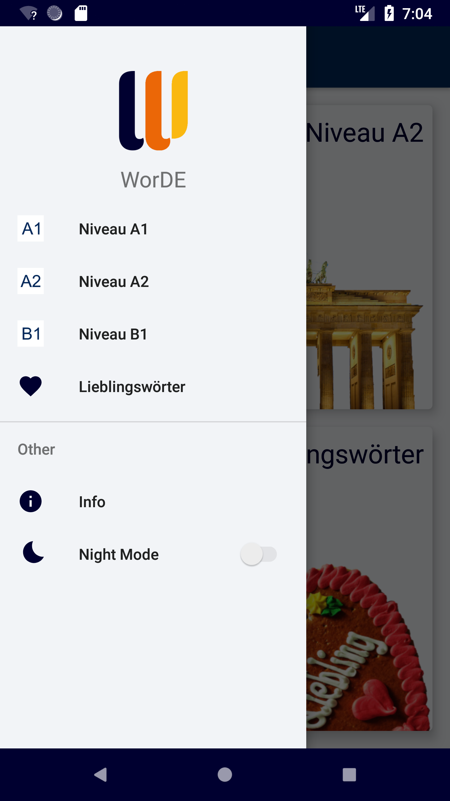

# WorDE
WorDE

Android Application on Java as Deutsch Vocabulary App on A1, A2 and B1 levels

● Published on PlayStore
● Uses Room persistence library on a local SQLite database
● Has a widget for “word of the day” and come back reminder notification
● Implements Firebase Analytics for user engagement and Crashlytics for crash reporting

