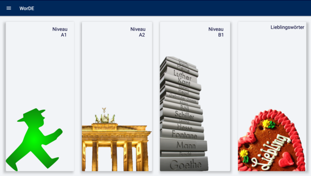
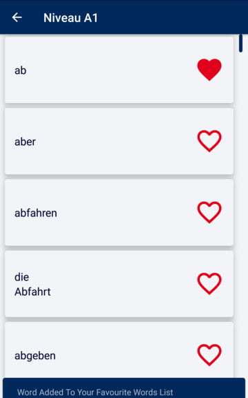
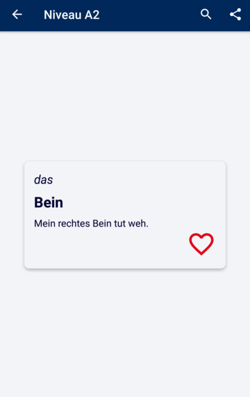
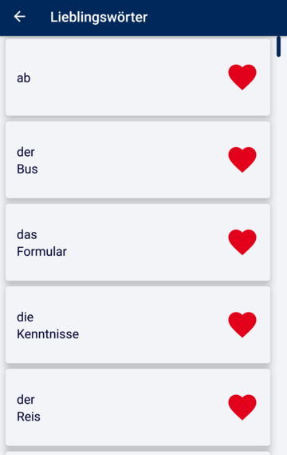
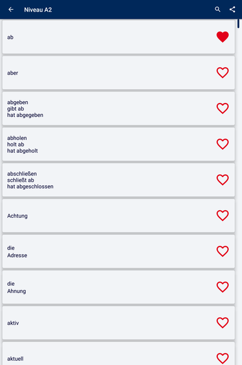
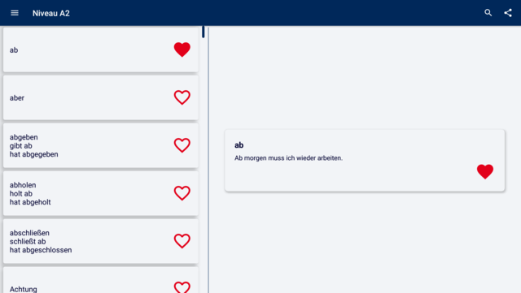

# WorDE
WorDE

Android Application on Java as Deutsch Vocabulary App on A1, A2 and B1 levels

● Published on [PlayStore](https://play.google.com/store/apps/details?id=com.WorDE.android.app)

● Uses Room persistence library on a local SQLite database

● Has a widget for “word of the day” and come back reminder notification

● Implements Firebase Analytics for user engagement and Crashlytics for crash reporting

